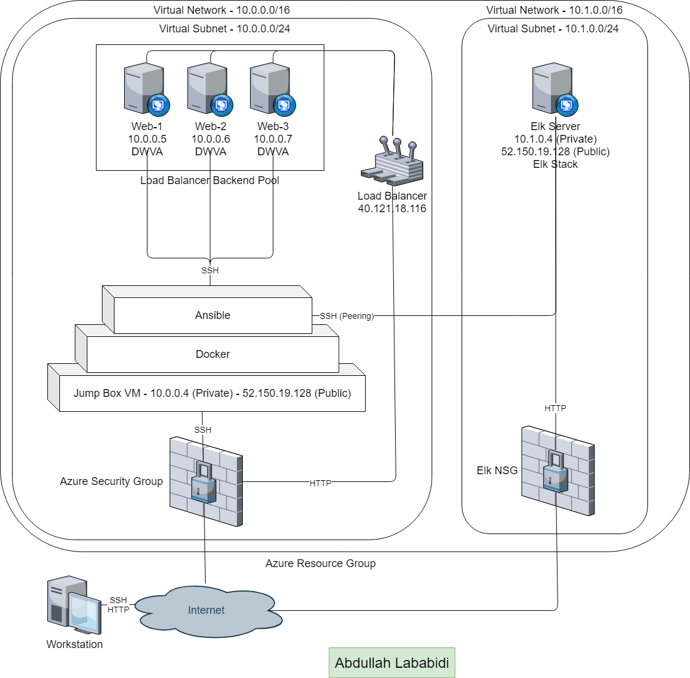
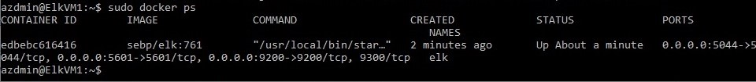

## Automated ELK Stack Deployment

Hello and welcome!

The files in this repository were used to configure the network depicted below.

These files have been tested and used to generate a live ELK deployment on Azure. They can be used to either recreate the entire deployment pictured above. Alternatively, select portions of the filebeat-playbook.yml and metricbeat-playbook.yml files may be used to install only certain pieces of it, such as Filebeat.

This document contains the following details:
- Description of the Topologu
- Access Policies
- ELK Configuration
  - Beats in Use
  - Machines Being Monitored
- How to Use the Ansible Build

### Description of the Topology

The main purpose of this network is to expose a load-balanced and monitored instance of DVWA, the D*mn Vulnerable Web Application.

Load balancing ensures that the application will be highly reliable, in addition to restricting access to the network.

Integrating an ELK server allows users to easily monitor the vulnerable VMs for changes to the logs and system metrics.

The configuration details of each machine may be found below.

| Name     | Function | IP Address | Operating System |
|----------|----------|------------|------------------|
| Jump Box | Gateway  | 10.0.0.1   | Linux            |
| Web 1    | DVWA     | 10.0.0.5   | Linux            |
| Web 2    | DVWA     | 10.0.0.6   | Linux            |
| Web 3    | DVWA     | 10.0.0.7   | Linux            |
| ElkVM1   | DVWA     | 10.1.0.4   | Linux            |

### Access Policies

The machines on the internal network are not exposed to the public Internet. 

Only the Jump Box machine can accept connections from the Internet. Access to this machine is only allowed from a previously set IP address.

Machines within the network can only be accessed by Jump Box VM.

A summary of the access policies in place can be found in the table below.

| Name     | Publicly Accessible | Allowed IP Addresses     |
|----------|---------------------|--------------------------|
| Jump Box | Yes                 | host machine IP address  |
| Web 1    | No                  | 10.0.0.1                 |
| Web 2    | No                  | 10.0.0.1                 |
| Web 3    | No                  | 10.0.0.1                 |
| ElkVM1   | Yes                 | host machine IP address  |

### Elk Configuration

Ansible was used to automate configuration of the ELK machine. No configuration was performed manually, which is advantageous because it can handle complex tasks and can be easily scalable, ie Ansible can be used to update programs and configuration on hundreds of servers at once, but the process is the same whether you’re managing one computer or dozens. 

The playbook implements the following tasks:
- Install docker
- Increase virtual memory
- Install python3
- Install container image sebp/elk:761

The following screenshot displays the result of running `docker ps` after successfully configuring the ELK instance.

### Target Machines & Beats
This ELK server is configured to monitor the following machines:
+ Web 1 - 10.0.0.5
+ Web 2 - 10.0.0.6
+ Web 3 - 10.0.0.7

We have installed the following Beats on these machines:
+ Filebeat
+ Metricbeat

These Beats allow us to collect the following information from each machine:
+ Filebeat forwards and centralizse a wide range of logs and files such as event and system logs
+ Metricbeat is a lightweight way to send system and service statistics such as CPU and memory utilization

### Using the Playbook
In order to use the playbook, you will need to have an Ansible control node already configured. Assuming you have such a control node provisioned: 

SSH into the control node and follow the steps below:
- Copy the filebeat-playbook.yml and metricbeat-playbook.yml files to /etc/ansible
- Update the /etc/ansible/hosts and filebeat.config/metricbeat.config files to include the host IP address and IP addresses of machines to monitor
- Run the playbook, and navigate to 40.121.18.116/app/kibana to check that the installation worked as expected.

### Commands used
To update/modify the YAML playbook file, use the following command in the directory the file is in:
+ "nano filebeat-playbook.yml"

To run a playbook file, use the following command inside /etc/ansible:
+ "ansible playbook filebeat-playbook.yml"
